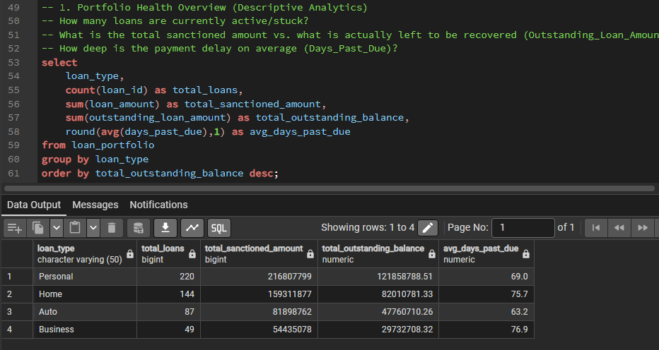
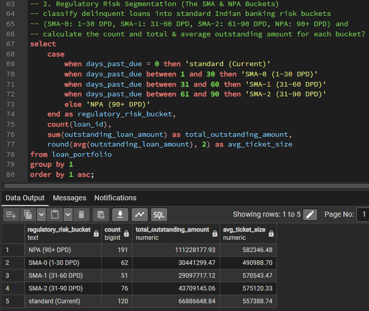
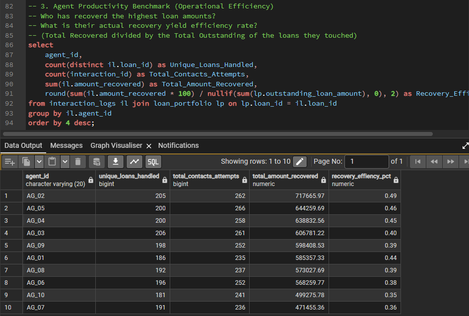
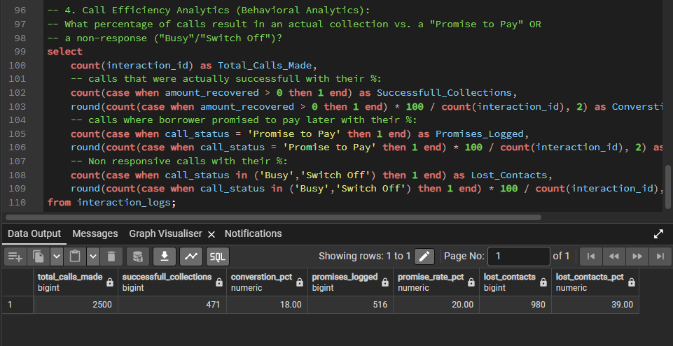
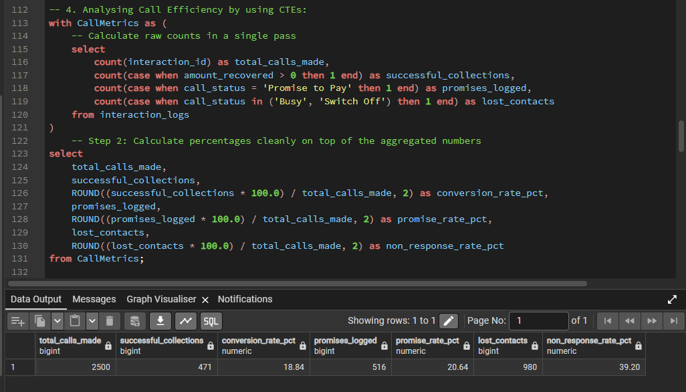
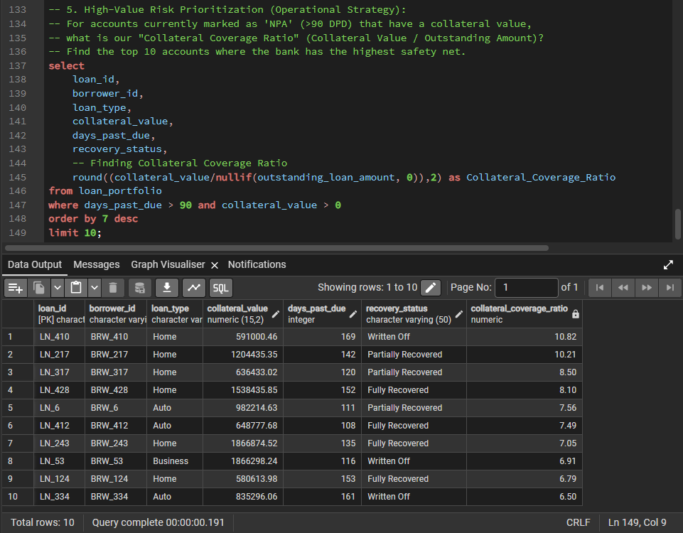

# SQL-BFSI-Non-Performing-Asset-NPA-Recovery-Pipeline-Analysis
This repository contains a full-stack financial data analytics architecture designed to evaluate credit risk, manage delinquency pipelines, and optimize collection operations for a retail banking loan portfolio.

Moving beyond standard prediction models, this project designs operational business intelligence pipelines to classify distressed assets according to standard regulatory thresholds and identify critical process leakage within a 2,500-row collection transaction database.

## 🛠️ Data Architecture & Relational Schema
The analytics warehouse is self-hosted on **PostgreSQL** utilizing two primary relational tables:
1. **`loan_portfolio`**: Master dimension containing structural borrowing attributes, outstanding fields, credit risk status, and structural collateral evaluations.
2. **`interaction_logs`**: Transactional table logging discrete field calling metrics, historical agent timelines, contact success flags, and fractional cash yields.

---

## 📈 Core Business Insights & Analytical Framework

In a real bank, a Risk or Collections Manager doesn't just want to see a raw list of names; they need to optimize operations and minimize loss. These 8 business questions cover descriptive, diagnostic, and operational analytics using advanced SQL concepts:

### 1. Portfolio Health (Descriptive Analysis): What is the total outstanding loan amount and the average number of days past due (DPD) across different asset classes (Home, Auto, Personal)?
*SQL Focus: Basic Aggregations (SUM, AVG), GROUP BY*

*Output Verification:*

### 2. Regulatory Risk Segmentation (Regulatory Reporting): Can we classify our delinquent loans into standard Indian banking risk buckets (SMA-0: 1-30 DPD, SMA-1: 31-60 DPD, SMA-2: 61-90 DPD, NPA: 90+ DPD) and calculate the count and total outstanding amount for each bucket?
*SQL Focus: Conditional logic (CASE WHEN)*

*Output Verification:*

### 3.	Agent Productivity Benchmark (Operational Efficiency): Which recovery agents have collected the highest total amount, and what is their success rate (Total Recovered divided by the Total Outstanding of the loans they touched)?
*SQL Focus: Multi-table JOIN, Aggregations.*

*Output Verification:*

### 4.	Call Efficiency Analytics (Behavioral Analytics): What percentage of calls result in an actual collection vs. a "Promise to Pay" or a non-response ("Busy"/"Switch Off")?
*SQL Focus: Filtered aggregations (COUNT(CASE WHEN...)).*

*Output Verification:*

*Using CTE:*

### 5.	High-Value Risk Prioritization (Operational Strategy): For accounts currently marked as 'NPA' (>90 DPD) that have a collateral value, what is our "Collateral Coverage Ratio" (Collateral Value / Outstanding Amount)? Find the top 10 accounts where the bank has the highest safety net.
*SQL Focus: Mathematical expressions, WHERE filtering, LIMIT/TOP.*

*Output Verification:*

### 🚀 How To Run Locally

Initialize local instance of PostgreSQL and open pgAdmin 4.
Run the DDL parameters located in the initialization headers to structure the database schema.
Import source CSV files setting HEADER parsing parameters to true.
Open the Query Tool, drop in scripts from queries.sql, and execute.

